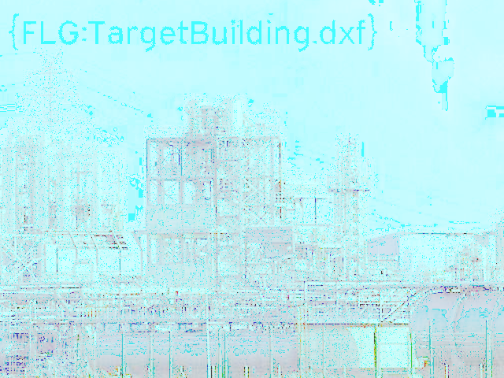

# Dig into the Blood

- Category: Miscellaneous
- Points: 200

In the zip file in the C&C server, R-boy’s found a folder. It contains an image showing the industrial site’s main building, one other file, and nothing else. It can't be another dead end! Help R-boy see if there’s anything hidden in the image.

The image is in here: [Dig+Into+The+Blood.png](https://challenges.reply.com/tamtamy/file/download-550687.action)

## Resolve

Use an _Image Editor_ (I used [Paint.NET](https://www.getpaint.net/)) to alter the image colors and then the **FLAG** will appear:

```text
{FLG:TargetBuilding.dxf}
```

This is a resulting image


